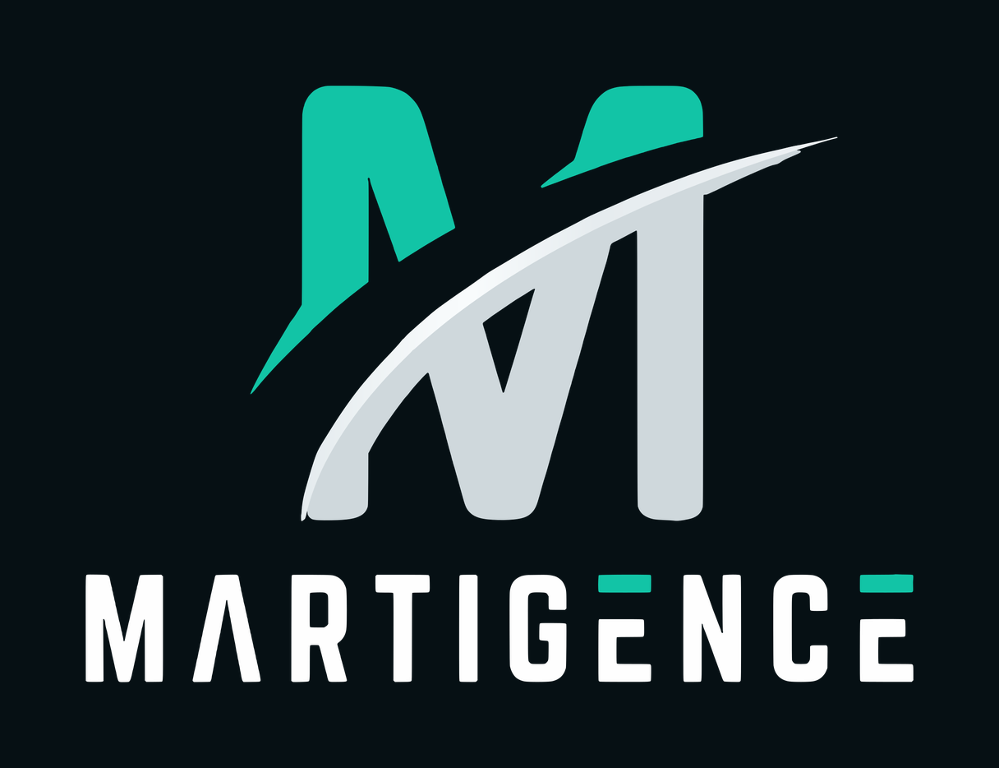

  

# Martigence

**Professional home and local skilled services, with fair and transparent matching.**

Martigence connects customers with skilled local professionals:

- Electrician
- Plumber
- Carpenter
- Painting
- Laundry
- Dry cleaning
- Car care
- Salon at home

## How it works

- **Fair, transparent AI matching:** customers are matched with providers by clear, explainable criteria.
- **Ranks program:** 7 levels for customers and providers: Apprentice, Hand, Skilled, Expert, Master, Guild, Grandmaster.
  Ranks are earned. **Nobody can pay for a higher rank.**
- **Who gets the job:** Among eligible pros who say YES, the one with the highest MatchScore gets the job; a tie goes to whoever said YES first.
- **Trust built in:** Every job has door codes (PRO, START, FINISH), a price that counts only after the customer says OK, and a tamper-proof job record.

## Launch

Target: **2027**. Deoghar first, then Dhanbad and Ranchi.

## Contact

- Website: [www.martigence.com](https://www.martigence.com) (you can also install it as a phone app from the site)
- WhatsApp: [+91 72505 22544](https://wa.me/917250522544)
- Email: [martigence@gmail.com](mailto:martigence@gmail.com)

**Follow Martigence:** [Instagram](https://instagram.com/martigence/) · [Facebook](https://facebook.com/martigence) · [X](https://x.com/martigence) · [YouTube](https://youtube.com/@martigence) · [LinkedIn](https://linkedin.com/company/martigence) · [Threads](https://threads.com/@martigence)

Founder: Roushan Kumar Singh ([@RoushanStartup](https://x.com/RoushanStartup))

---

MARTIGENCE® is a registered trademark of Roushan Kumar Singh.
